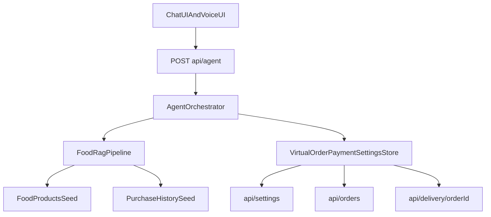

# Glider Agentic AI MVP 산출물

## 1) 전체 시스템 구조

- 외부 커머스 API/실제 PG 미연동
- 식료품 seed 기반 RAG + 가상 주문/결제/배송 상태 시뮬레이션
- 채팅 UI + 설정/주문조회 페이지 + 음성(STT/TTS) 연동

## 2) Next.js 프로젝트 구조

- `app/page.tsx`: 메인 챗봇 화면
- `components/AIAssistantUI.tsx`: 메인 오케스트레이션 UI
- `components/ChatPane.tsx`: 메시지/상태/후보카드/주문요약 렌더링
- `app/api/agent/route.ts`: 에이전트 메인 API
- `app/api/settings/route.ts`: 설정 API
- `app/api/orders/route.ts`: 주문조회 API
- `app/api/delivery/[orderId]/route.ts`: 배송조회 API
- `lib/agent-orchestrator.ts`: 상태머신 + 구매 실행 오케스트레이터
- `lib/food-rag.ts`: 식료품/구매이력 기반 하이브리드 RAG
- `lib/sqlite-store.ts`: 가상 주문/결제/배송/설정 저장소
- `data/products.seed.ts`: 식료품 seed 데이터
- `data/purchase-history.seed.ts`: 가상 구매이력 seed
- `hooks/use-voice-assistant.ts`: STT/TTS

## 3) 상품 DB 스키마

`FoodProduct` (식료품 전용):

- `product_id`
- `product_name`
- `normalized_name`
- `category`
- `subcategory`
- `brand`
- `description`
- `accessibility_summary`
- `price`
- `discount_price`
- `stock`
- `stock_status`
- `options`
- `unit`
- `weight_or_volume`
- `delivery_type`
- `delivery_eta`
- `merchant_name`
- `freshness_note`
- `tags`
- `popularity_score`
- `repurchase_score`
- `seasonal_flag`
- `created_at`
- `updated_at`

## 4) 100개 seed 식료품 데이터

- 파일: `data/products.seed.ts`
- 총 개수: 113개
- 카테고리 제한 준수:
  - 과일, 채소, 샐러드/간편채소, 계란, 두부/콩나물/버섯, 우유/요거트, 생수, 주스/두유, 쌀/잡곡, 기본 식재료, 냉장 간편식, 소량 신선식품
- 금지 카테고리 미포함
- 대표 시나리오 상품 포함:
  - 애플망고, 딸기, 바나나, 토마토, 상추, 오이, 양파, 감자, 두유, 생수

## 5) 구매 이력 DB 스키마

`PurchaseHistoryItem`:

- `order_id`
- `user_id`
- `product_id`
- `product_name_snapshot`
- `quantity`
- `selected_options`
- `purchased_at`
- `paid_amount`
- `payment_method`
- `merchant_name`
- `delivery_status`
- `reorderable`

파일: `data/purchase-history.seed.ts`

## 6) UCP 공통 스키마

`UCPProduct`:

- `product_id`
- `canonical_name`
- `merchant_name`
- `category`
- `subcategory`
- `price`
- `discount_price`
- `stock_status`
- `option_set`
- `delivery_eta`
- `freshness_note`
- `repurchase_eligible`
- `accessibility_summary`

`UCPOrder`:

- `order_id`
- `user_id`
- `product_id`
- `quantity`
- `selected_options`
- `payment_method`
- `status`
- `eta`
- `confirmation_required`
- `created_at`

## 7) RAG 검색 흐름

1. 사용자 질의 임베딩 생성
2. 식료품 seed 임베딩과 코사인 유사도 계산
3. 규칙 점수 결합:
   - 재구매 이력 가중치
   - 카테고리 키워드 일치
   - 가격 조건
   - 배송 속도(오늘/즉시)
   - 옵션 단순성
   - 재고 상태
4. 상위 2~3개 후보 압축
5. LLM 응답에서 추천 이유 포함

## 8) 상태 머신 설명

지원 상태:

- `idle`
- `searching_products`
- `showing_candidates`
- `awaiting_purchase_confirmation`
- `processing_payment`
- `order_completed`
- `viewing_order_history`
- `tracking_delivery`
- `updating_address`
- `updating_payment_method`
- `updating_voice`
- `updating_accessibility`

핵심 전환:

- 구매 의도 감지 -> 검색 -> 후보 제시 -> 번호 선택 -> 구매확인 -> 결제/주문 완료
- 관리성 질의(주문내역/배송조회/설정변경)는 별도 관리 상태로 진입

## 9) 대표 시나리오 동작 예시

입력: `B마트에서 저번에 구매했던 애플망고 사줘.`

- 상태: `showing_candidates`
- 재구매 이력 매칭 + 애플망고 후보 2~3개 제시

입력: `1번`

- 상태: `awaiting_purchase_confirmation`
- 주문요약(상품/수량/결제수단/배송 ETA) 제시

입력: `구매해줘`

- 상태: `order_completed`
- 보조 상태 메시지:
  - 결제 진행 중
  - 결제 완료
  - 주문 완료
  - 배송 상태 생성 완료

## 10) 실제 수정 파일 목록

- `lib/ucp-types.ts`
- `prisma/schema.prisma`
- `lib/prisma.ts`
- `data/products.seed.ts`
- `data/purchase-history.seed.ts`
- `data/loaders.ts`
- `lib/sqlite-store.ts`
- `lib/food-rag.ts`
- `lib/agent-orchestrator.ts`
- `app/api/agent/route.ts`
- `app/api/settings/route.ts`
- `app/api/orders/route.ts`
- `app/api/delivery/[orderId]/route.ts`
- `hooks/use-voice-assistant.ts`
- `components/AIAssistantUI.tsx`
- `components/ChatPane.tsx`
- `components/Composer.tsx`
- `components/Sidebar.tsx`
- `app/settings/page.tsx`
- `app/orders/page.tsx`

## 11) 실제 커머스 연동 시 확장 방향

- `lib/food-rag.ts`의 seed 로더를 실제 상품 카탈로그 커넥터로 교체
- `lib/sqlite-store.ts`의 가상 주문/결제 생성부를 외부 OMS/PG 어댑터로 교체
- `lib/agent-orchestrator.ts` 상태머신은 유지하고, 실행 핸들러만 실제 API 어댑터로 변경
- `UCPProduct`, `UCPOrder` 스키마를 API contract로 유지해 멀티 커머스 연동 일관성 확보
# Agentic Commerce MVP 산출물 정리

## 1) 시스템 구조

- **UI 레이어**
  - `components/AIAssistantUI.tsx`: 채팅 상태/세션/음성 입력 연동, `/api/agent` 호출
  - `components/ChatPane.tsx`: `mainMessage`, `statusMessages`, `cards` 렌더링
- **API 레이어**
  - `app/api/agent/route.ts`: 액션 기반 요청(`order_history`, `track_delivery`, 설정 변경 등)과 일반 메시지 처리 분기
- **오케스트레이션 레이어**
  - `lib/agent-orchestrator.ts`: 상태머신(`idle -> searching_products -> showing_candidates -> awaiting_purchase_confirmation -> processing_payment -> order_completed`) 및 관리 상태(`viewing_order_history`, `tracking_delivery`, 설정 변경 상태) 처리
- **RAG/추천 레이어**
  - `lib/food-rag.ts`: 재구매 이력 매칭 + 상품 후보 검색(임베딩 기반, 실패 시 키워드 폴백)
- **저장 레이어**
  - `lib/sqlite-store.ts`: 사용자 설정, 가상 주문, 배송 이벤트 SQLite 저장/조회
  - `data/*.seed.ts`: 식료품/구매이력 시드
  - `prisma/schema.prisma`: 확장 가능한 정규 모델 정의

## 2) 데이터/응답 스키마

- **도메인 타입**
  - `lib/ucp-types.ts`
  - 핵심 타입: `FoodProduct`, `PurchaseHistoryItem`, `UCPProduct`, `AgentStage`, `AgentResponse`
- **API 응답 구조**
  - `mainMessage`: 메인 자연어 응답
  - `statusMessages[]`: 단계별 상태 알림
  - `candidateCards[]`: 후보 상품 구조화 카드
  - `orderSummary`: 주문/결제/배송 요약
  - `uiActions[]`: UI 액션 힌트
  - `cards[]`: 기존 UI 호환 렌더 카드(레거시 호환)
- **DB 스키마**
  - 런타임 저장: `lib/sqlite-store.ts`의 `user_settings`, `orders`, `delivery_events`
  - 확장 스키마: `prisma/schema.prisma`의 `UserProfile`, `Address`, `PaymentMethod`, `VoicePreference`, `AccessibilityPreference`, `VirtualOrder`, `VirtualPayment`, `DeliveryTrackingEvent`

## 3) 처리 흐름

- **대표 재구매 시나리오**
  1. 사용자가 `"B마트에서 저번에 구매했던 애플망고 사줘"` 요청
  2. `findReorderItem`이 과거 구매 이력에서 재구매 상품 탐지
  3. `retrieveProductCandidates`가 상위 후보 2~3개 반환
  4. 사용자가 `"1번"` 선택 -> `awaiting_purchase_confirmation`
  5. 사용자가 `"네, 결제 진행해줘"` 확정 -> 가상 결제/주문 생성
  6. 주문내역/배송조회 요청 시 최신 주문과 배송 이벤트 반환
- **오프라인 안정성**
  - `OPENAI_API_KEY` 미설정 또는 OpenAI 호출 실패 시 `food-rag` 키워드 폴백으로 후보 추천 유지

## 4) 수정 파일 목록 (이번 작업)

- `lib/food-rag.ts`
  - OpenAI 의존 실패 시 폴백 검색/응답 로직 추가
  - 재구매 시나리오가 키 없이도 동작하도록 안정화
- `tests/e2e/reorder-scenario.test.ts` (신규)
  - 대표 시나리오 E2E 추가
  - 검증 포인트: 재구매 이력 매칭, 후보 제시, 구매 확정, 결제 완료, 주문내역/배송조회
- `package.json`
  - `test:e2e` 스크립트 추가
  - `tsx` 개발 의존성 추가
- `package-lock.json`
  - 의존성 변경 반영

## 5) 검증 결과

- 실행 명령: `npm run test:e2e`
- 결과: 통과(1/1)
- 포함 검증:
  - 재구매 의도 인식 및 후보 노출
  - 구매 확인/결제 완료 상태 전이
  - 주문내역 조회
  - 배송조회 이벤트 확인

## 6) 확장 방향 (실제 커머스 연동 시 교체 지점)

- `lib/food-rag.ts`
  - 현재 시드 기반 검색/랭킹 -> 실제 상품 카탈로그 검색 API로 교체
- `lib/sqlite-store.ts`
  - 현재 단일 로컬 SQLite -> 트랜잭션/동시성 고려한 운영 DB(Prisma)로 이관
- `createVirtualOrder` 경로
  - 현재 가상 결제/배송 이벤트 생성 -> PG사/OMS/배송사 연동 이벤트 파이프라인으로 교체
- `uiActions` 해석 레이어
  - 현재 문자열 프로토콜 -> 타입 안전한 액션 계약(예: enum + payload 스키마)으로 고도화
- 테스트
  - 현재 오케스트레이터 E2E(함수 기반) -> API 레벨/브라우저 레벨 E2E를 추가해 실사용 플로우까지 확장
